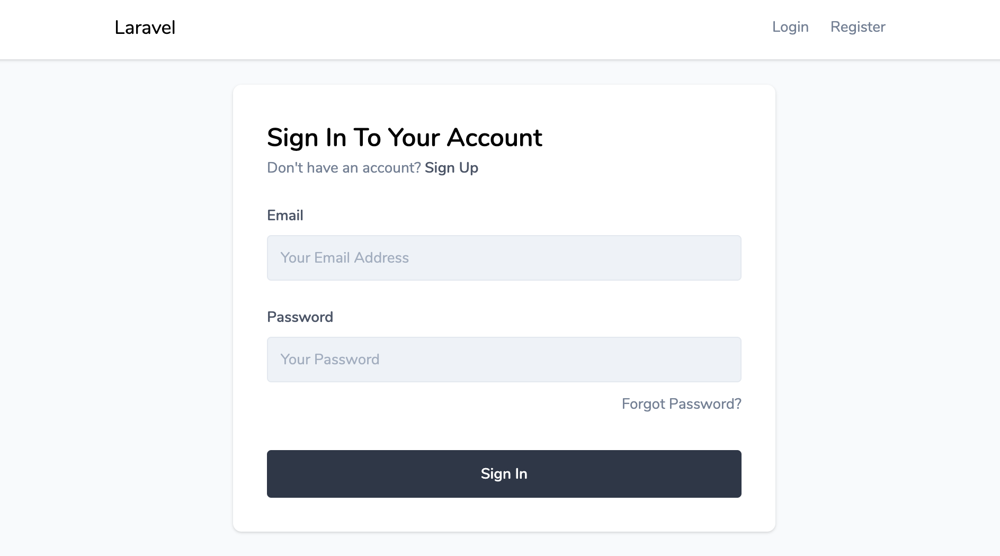
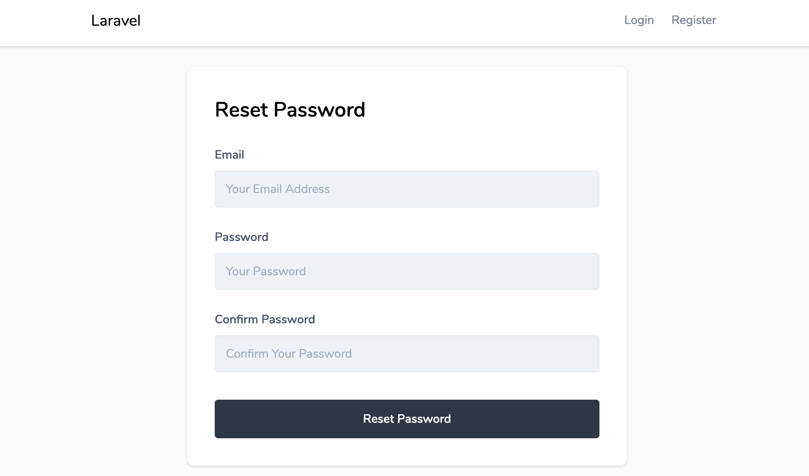
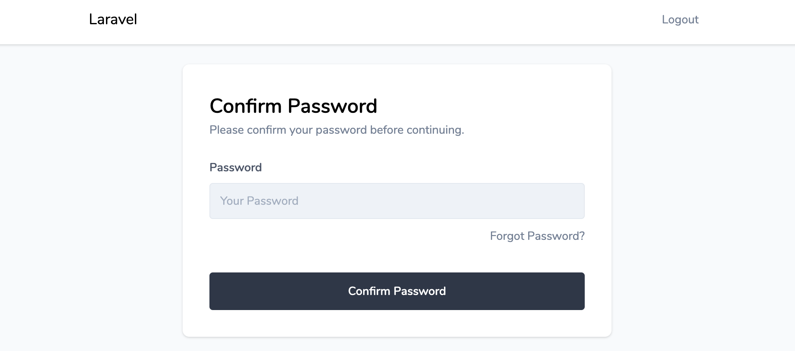
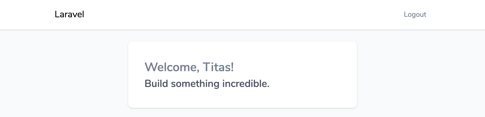

# Laravel Moonlight

Laravel Moonlight is a bateries included preset with **Inertia**, **Vue** and **Tailwind** scaffolding.

This preset allows you to start building Laravel single-page-applications right away.
Forget about commond SPA pain points like authentication, routing, CSRF, state manegement, etc. and focus on what's important- your application.

## Features

* Tailwind
* Inertia
* Vue
    * Initial landing page view.
    * Authentication views.
    * Password confirmation view.
* Ziggy (use named routes inside your javascript).

## Installation

Installed using composer:
```bash
composer require titasgailius/laravel-moonlight
```

## Usage

Once the package has been installed, you may install the scaffolding using the ui Artisan command:

```bash
// Basic scaffolding
php artisan ui moonlight

// Include authentication scaffolding
php artisan ui moonlight --auth
```

## Screenshots


---

---

---

---




## Project Structure
```
project
│ - webpack.mix.js
│
└───resources
│   |
│   └───js
│   |   │ - app.js
│   |   │ - bootstrap.js
│   |   │ 
│   |   └───components // Auto-registered vue components.
|   |   |   | - form-input.vue
|   |   |
│   |   └───layouts
|   |   |   | - app.vue
|   |   |
│   |   └───pages // This is where you put your application pages.
│   |       │ - home.vue 
│   |       │ - welcome.vue
│   |       │
│   |       └───auth
│   |           │ - login.vue 
│   |           │ - register.vue 
│   |           │ - verify.vue 
│   |           │
│   |           └───passwords
│   |               │ - confirm.vue
│   |               │ - email.vue
│   |               │ - reset.vue
│   |
│   └───sass
│   |   | - app.scss
│   │
│   └───views
│       │ - app.blade.php
|
└───app/Providers
    │ - InertiaServiceProvider.php
```

## Notes

If you would want to remove this package after the scaffolding is generated, you would need to add `App\Providers\InertiaServiceProvider::class` to your service providers list in `config/app.php` file.